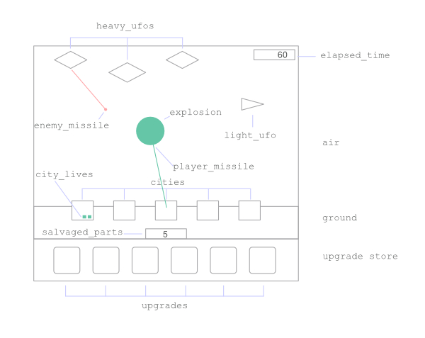

# Missile Command game


## User Experience (UX)

### User stories:

#### User goals:
<details>
  <summary>
  <b>click to view</b>

  </summary>

  ##### General visitor to the site:
   1. As a player, I want to play as long as i want, no time constraint.
   2. As a player, I want to play with easy clicks on desktop.
   3. As a player, I want to upgrade if I reach a certain level of game.
   4. As a player, i want to get powerups at different level of the game.
   5. As a player, I want to see my progress as a score.

  ##### Returning site user:
</details>

#### Developer goals:
<details>
  <summary>
  <b>click to view</b>
  </summary>
  
  1. As a game developer, I want to create a user friendly and easy to play game.
  2. As a developer, I want to give different levels of difficulties in the game.
  3. As a developer, I want to give a time counter for the players to see their progress.
  4. As a developer, I want to give upgrades to the players, when they reach a certain level.
  5. As a developer, I want to give powerup option to the players.
</details>

## Project Design

### Colour scheme:
<details>
  <summary>
  <b>click to view</b>
  </summary>


</details>

### Typography:
<details>
  <summary>
  <b>click to view</b>
  </summary>

- #### Primary font...

  - **Family:** [Poppins](https://fonts.google.com/specimen/Poppins)
  - **Weights:** 300, 400, 500
  - **Fallback:** `sans-serif`

- #### Secondary (Heading) font...

  - **Family:** [Lora](https://fonts.google.com/specimen/Lora)
  - **Weights:** 600, 700
  - **Fallback:** `serif`
</details>

### Wireframes:
<details>
  <summary>
  <b>click to view</b>
  </summary>

  
</details>

## Features

### Existing Features:

- #### `nav`:

  - ##### Fixed Navigation Bar:
  <details>
    <summary>
    <b>click to view</b>
    </summary>
  </details>

  - ##### (Off-Canvas) Navigation Menu:
  <details>
    <summary>
    <b>click to view</b>
    </summary>
  </details>

- #### `header`:
<details>
  <summary>
  <b>click to view</b>
  </summary>  
</details>

- #### `main`:

  - ###### `section` A:
  <details>
    <summary>
    <b>click to view</b>
    </summary>
  </details>

  - ###### `section` B:
  <details>
    <summary>
    <b>click to view</b>
    </summary>
  </details>

  - ###### `section` C:
  <details>
    <summary>
    <b>click to view</b>
    </summary>
  </details>

- #### `footer`:
<details>
  <summary>
  <b>click to view</b>
  </summary>
</details>

### Potential Future Features:

- #### Future feature X:
<details>
  <summary>
  <b>click to view</b>
  </summary>
</details>

- #### Future feature Y:
<details>
  <summary>
  <b>click to view</b>
  </summary>
</details>

- #### Future feature Z:
<details>
  <summary>
  <b>click to view</b>
  </summary>
</details>

## Technologies Used

### Languages:
<details>
  <summary>
  <b>click to view</b>
  </summary>

- [HTML5:](https://en.wikipedia.org/wiki/HTML5) used for structuring the site
- [CSS3:](https://en.wikipedia.org/wiki/Cascading_Style_Sheets) used for styling the site
- [JavaScript:](https://en.wikipedia.org/wiki/JavaScript) used for site logic and web page behaviour
</details>

### Frameworks/Libraries, APIs, Programmes and Tools:
<details>
  <summary>
  <b>click to view</b>
  </summary>

- [Google Fonts:](https://fonts.google.com/) used to import the Poppins and Lora fonts into the project's stylesheets
- [Font Awesome v5.15.3:](https://fontawesome.com/) used to add appropriate and visually appealing site icons
- [Visual Studio Code:](https://code.visualstudio.com/) used as the team's IDE for the project
- [Git:](https://git-scm.com/) used for version control by utilising the Gitpod terminal to commit frequently to Git and push all commits to GitHub
- [GitHub:](https://github.com/) used to compile and remotely store the project's codebase following successive local commits initiated from the command line
- [TinyJPG:](https://tinyjpg.com/) used for image compression
- [PicResize:](https://picresize.com/) used to crop and resize images
- [WebAIM (contrast checker):](https://webaim.org/resources/contrastchecker/) / [WAVE Web Accessibility Evaluation Tool](https://wave.webaim.org/) used to ensure site foreground and background colour contrasts meet [WCAG 2 accessibility requirements](https://webaim.org/articles/contrast/)
- [Can I Use:](https://caniuse.com/) browser compatibility tables used to cross-reference the viability of implementing certain HTML5 elements, CSS3 properties, file formats etc.
</details>

## Testing

Full project testing details can be found [here](testing.md)

## Deployment

### GitHub Pages:
<details>
  <summary>
  <b>click to view</b>
  </summary>

This project has been deployed to [GitHub Pages](https://en.wikipedia.org/wiki/GitHub#GitHub_Pages). The deployment process carried out was as follows...

1. [**Sign in** to GitHub](https://github.com/login) and locate the [relevant repository](https://github.com/CharlieMallon/RetroGamingHackathonTeam5). If you do not have a GitHub account, you may create one [here](https://github.com/signup).
2. At the top of the project repository page, select **Settings**. 
3. On the Settings page, scroll down the menu flanking the left-hand side of the screen and select **Pages** near the bottom of the list of options.

This will open GitHub Pages....

4. Under **Source**, click the dropdown displaying **Branch: None** and select the **master** branch. Click **Save**. 
5. The page will then automatically refresh and inform you that the site is now ready to be published, as well as indicating the `https://` address to be used. 
6. For reference purposes, a link to this newly-published site can be found in the **Pages** section of **Settings** (described above).
</details>

### Forking the GitHub repository:
<details>
  <summary>
  <b>click to view</b>
  </summary>

It is possible to fork this GitHub repository to view and/or make changes without affecting the original. This is achieved by following these steps...

1. [**Sign in** to your GitHub account](https://github.com/login) and locate the [relevant repository](https://github.com/CharlieMallon/RetroGamingHackathonTeam5).
2. Click on **Fork**, located near the top right-hand corner of the repository page.
3. You will now have a copy of this project's repository in your own GitHub account.
</details>

### Making a local clone:
<details>
  <summary>
  <b>click to view</b>
  </summary>

It is possible to copy the repository to your local machine so that you can fix merge conflicts, add or remove files and push larger commits without affecting the original project code. Cloning a repository pulls down a full copy of all the repo data that GitHub has at that point in time. See the [GitHub Docs](https://docs.github.com/en/github/creating-cloning-and-archiving-repositories/cloning-a-repository) for further information, and below for a brief summary...

1. [**Sign in** to your GitHub account](https://github.com/login) and locate the [relevant repository](https://github.com/CharlieMallon/RetroGamingHackathonTeam5).
2. Click on the **Code** dropdown next to the green **Gitpod** button. This will reveal the **Clone** option.
3. In order to clone the repository using `HTTPS`, select **HTTPS** and copy the link shown (there is a copy button to the right of the URL).
4. Next, open **Git Bash** (see [here](https://git-scm.com/downloads) for an overview of download options, if required).
5. Change the current working directory on your local machine to the location where you want the cloning to be made.
6. Type `git clone` into your IDE terminal followed by the URL you copied in Step 3 above, i.e.

```
https://github.com/CharlieMallon/RetroGamingHackathonTeam5.git
```

7. Press **Enter**. 
8. Your local clone has now been created.

_See the [GitHub Docs](https://docs.github.com/en/github/creating-cloning-and-archiving-repositories) for more information on all of the above processes._
</details>

## Credits

### Code:

Where code blocks/snippets/suggestions have been incorporated from external sources into this project's code, these have been noted through the use of comments. Beyond this, the developers made use of the following articles, workarounds and learning resources while building the site:
<details>
  <summary>
  <b>click to view</b>
  </summary>

- ['Really helpful article/resource/tutorial #1'](#) (MDN Web Docs)
- ['Really helpful article/resource/tutorial #2'](#) (Stack Overflow)
- ['Really helpful article/resource/tutorial #3'](#) (CSS-Tricks)
</details>

### Content:
<details>
  <summary>
  <b>click to view</b>
  </summary>
</details>

### Media:
<details>
  <summary>
  <b>click to view</b>
  </summary>

| [**Website section**] Media title/description  | Media format  | Credit  | Link to original media source(s)  | 
| :------------ |:--------------- |:-----|:---------------|
| **`header`**         |                 |      |                |
| title/description goes here      | format category goes here       | [Bob Random Photographer](#)      | [Pexels](https://www.pexels.com/photo/calm-sea-under-blue-sky-4571251)      |
| **`main`**         |                 |      |                |
| title/description goes here      | format category goes here       | [Bob Random Photographer](#)      | [Pexels](https://www.pexels.com/photo/calm-sea-under-blue-sky-4571251)      |
| **`footer`**         |                 |      |                |
| title/description goes here      | format category goes here       | [Bob Random Photographer](#)      | [Pexels](https://www.pexels.com/photo/calm-sea-under-blue-sky-4571251)      |
</details>

### Acknowledgments:

## Notice

This site has been created for development purposes only.