## Testing

### Validation:

  

  <b>click to view</b>
  

- [W3C](https://www.w3.org/)'s [Markup Validation Service](https://validator.w3.org/) was used to test the validity of all HTML used in this project. The code was [validated by direct input](https://validator.w3.org/#validate_by_input), and all suggested corrections were then made. As a result, all of the site's HTML source code now passes W3C validation with just a single warning message being returned, as is reflected in the following screenshot:
  - [index.html validation](#)

- Likewise, the website's custom CSS stylesheet was checked for errors using [W3C](https://www.w3.org/)'s [CSS Validation Service](https://jigsaw.w3.org/css-validator/). Once again, [validation by direct input](https://jigsaw.w3.org/css-validator/#validate_by_input) was the preferred method selected, and all necessary changes were subsequently carried out. Consequently, the stylesheet now returns a "Congratulations! No error found." message upon being passed through this validator, as the following screenshot indicates:
  - [static/css/style.css validation](#)

- In a similar manner, all of the site's custom JavaScript files were validated against [JSHint](https://jshint.com/)'s error-detection tool, which is available both as an online linter and a Gitpod/VS Code extension for real-time JS problem-solving. After heeding various warning and error messages, at the time of deployment each of these .js documents passed JSHint validation with no problems detected.

|   |   |   | 
| :------------: |:---------------: |:-----:|
         |                 | 

### Responsiveness:

  

  <b>click to view</b>
  

  - All testing was performed manually, and on a near-constant basis as the project evolved. [Google Chrome DevTools](https://developers.google.com/web/tools/chrome-devtools/?utm_source=dcc&utm_medium=redirect&utm_campaign=2018Q2) served as an indispensable resource throughout this testing process, allowing incremental adjustments to be made to the site's infrastructure and layout. The site's responsiveness was also closely monitored and rigorously tested from start to finish using the developer-oriented [Responsively App browser](https://responsively.app/).

| Devices |  |  |  |  |   |   |   |   |   |   |   |   | 
| :------------ |:---------------: |:---------------:|:---------------:|:---------------: |:---------------:|:---------------:|:---------------: |:---------------:|:---------------:|:---------------: |:---------------:|:---------------:|
|    **Samsung Galaxy S5**      |                 |      |                |        |       |         |       |       |       |         |       | 
|    **Huawei P20**     |                 |      |                |        |       |         |       |       |       |         |       |   
|    **Moto G4**      |                 |      |                |        |       |         |       |       |       |         |       |   
|    **Kindle Fire HD**      |                 |      |                |        |       |         |       |       |       |         |       |   
|    **MacBook Pro**      |     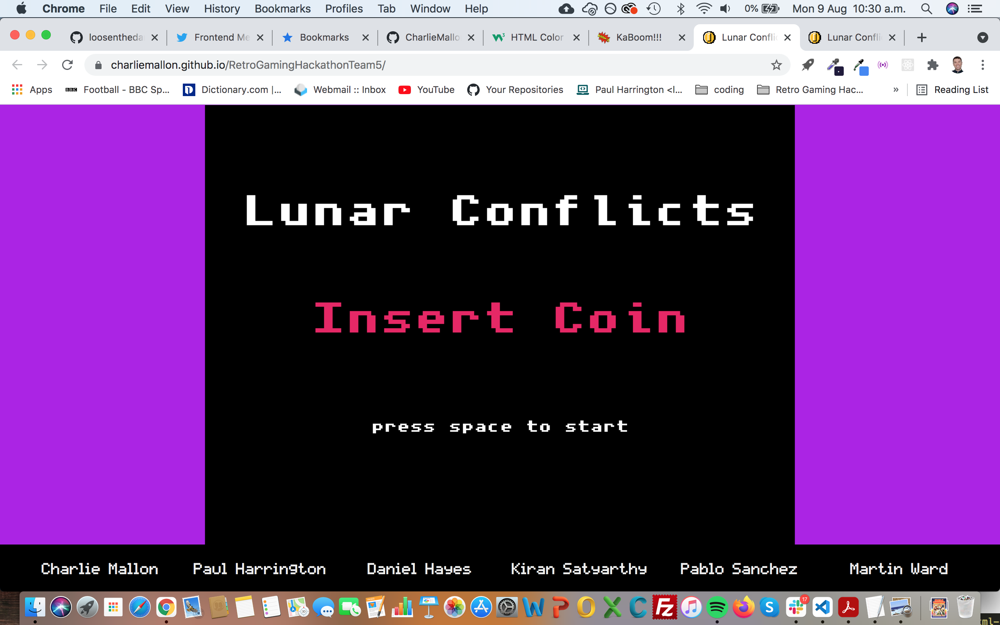            |   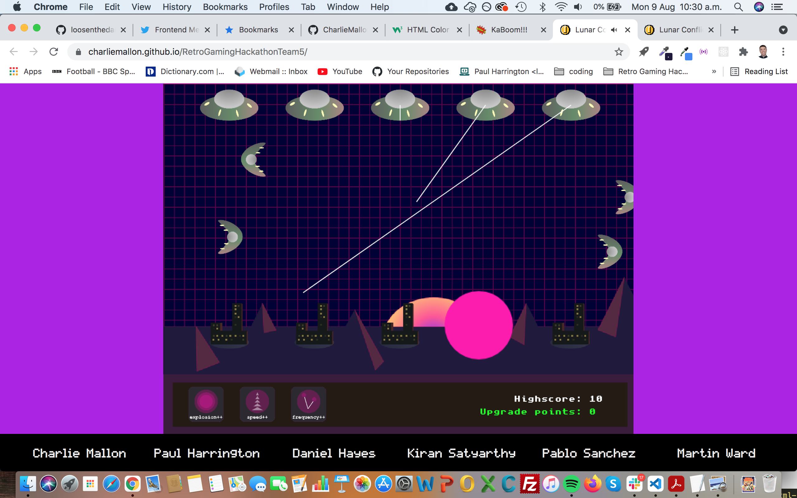   |     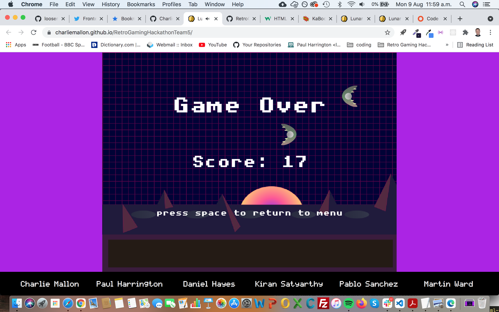           |        |       |         |       |       |       |         |       | 
|    **Acer ΛSPIRE**      |     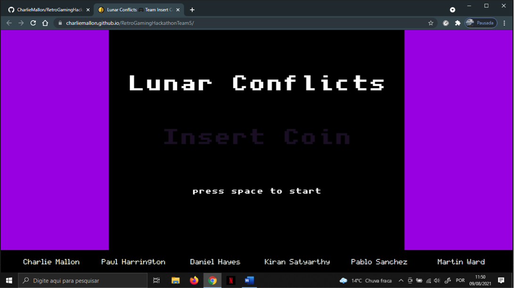            |   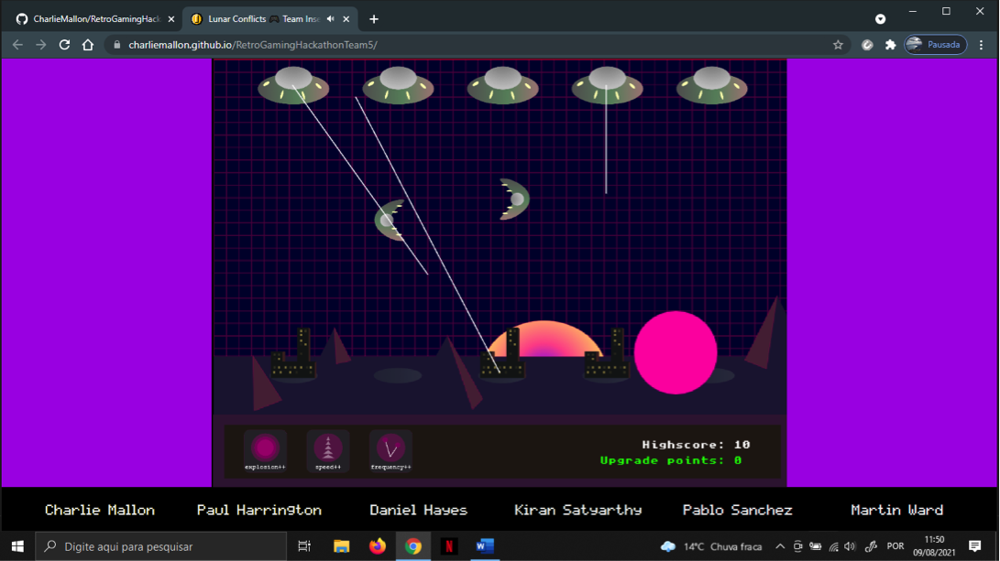   |     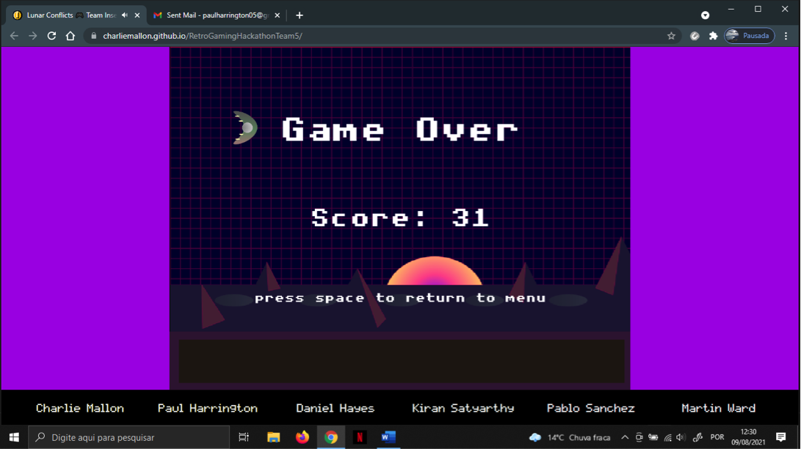           |        |       |         |       |       |       |         |       | 
|    **Android Smart TV**      |     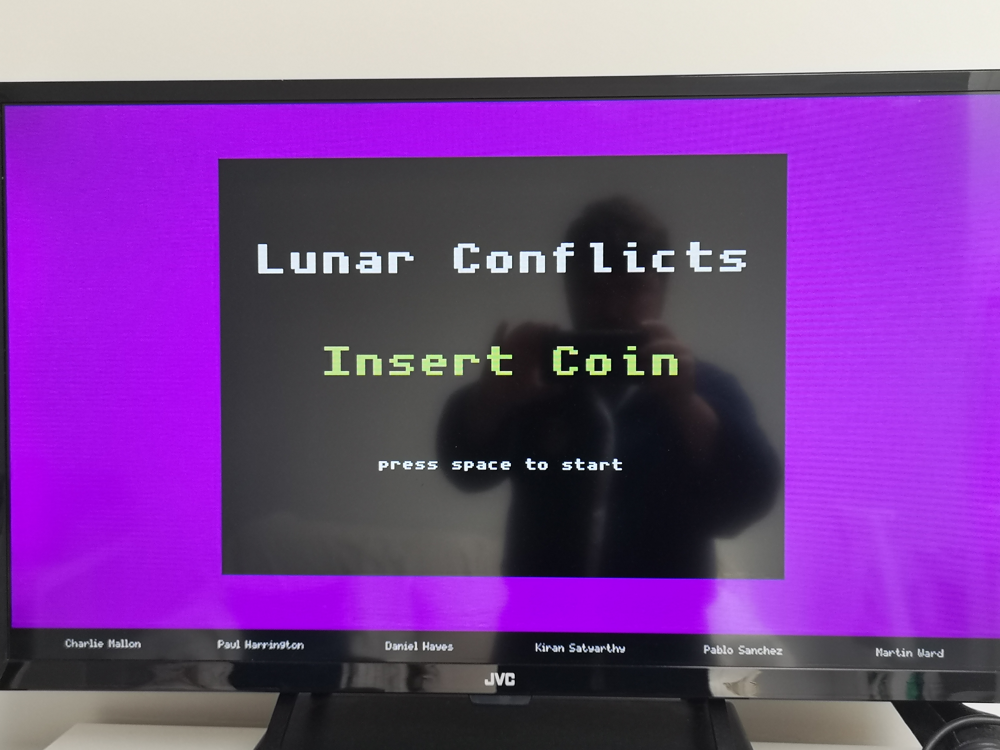            |      |                |        |       |         |       |       |       |         |       | 

| Browsers |  |  |  |  |   |   |   |   |   |   |   |   | 
| :------------ |:---------------: |:---------------:|:---------------:|:---------------: |:---------------:|:---------------:|:---------------: |:---------------:|:---------------:|:---------------: |:---------------:|:---------------:|
|          |                 |      |                |        |       |         |       |       |       |         |       | 
|         |     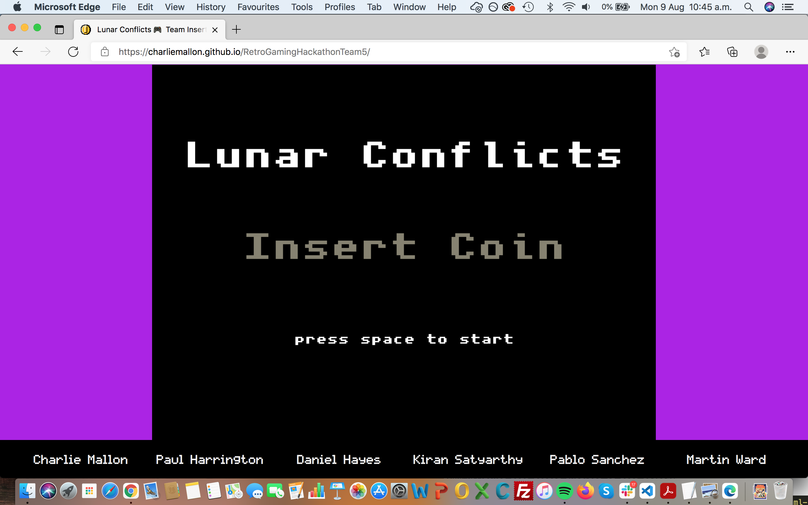            |   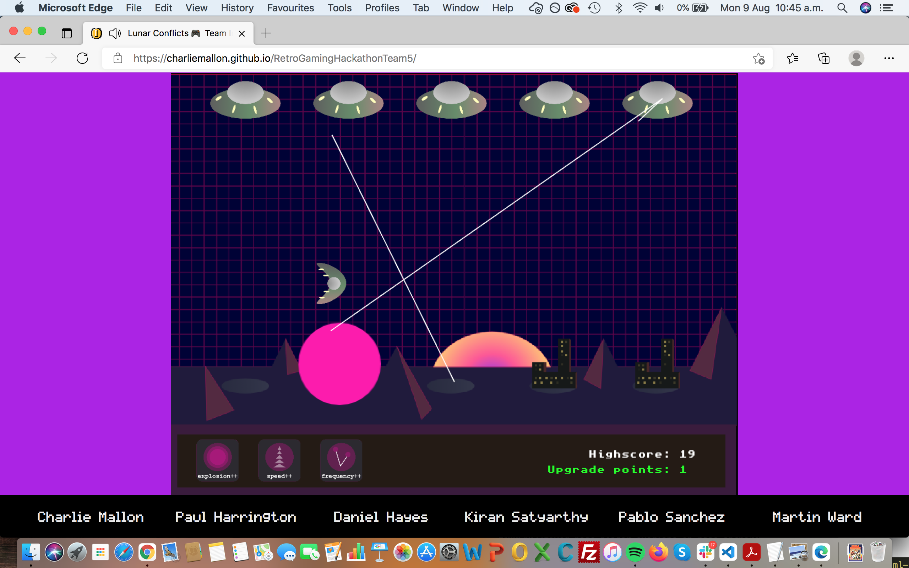   |     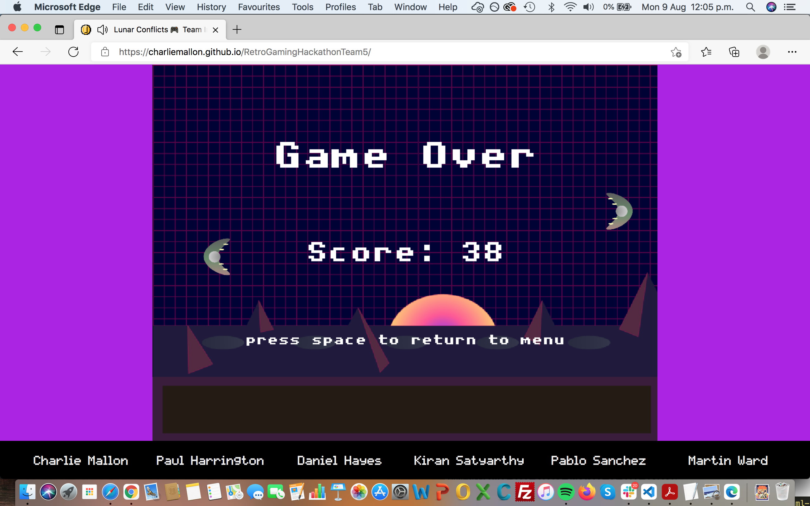           |            |       |       |       |         |       |   |       | 
|          |     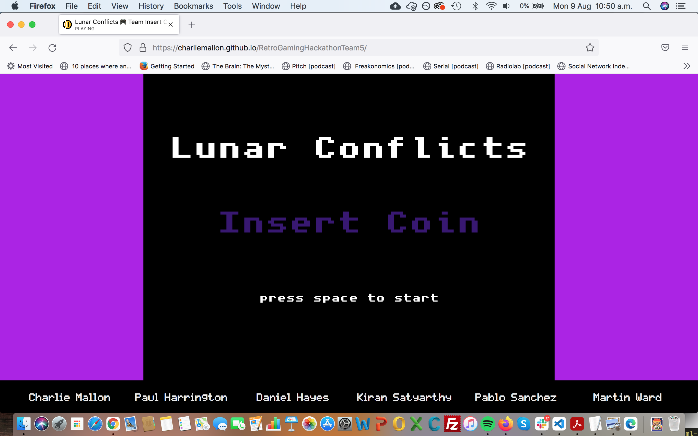            |   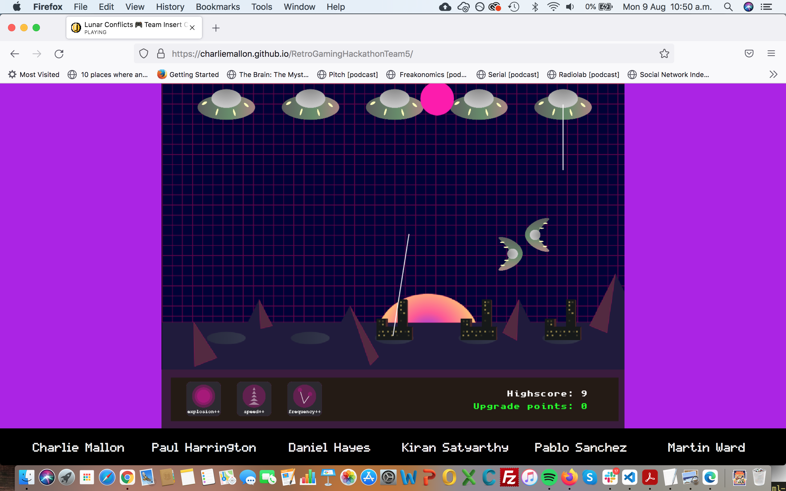   |     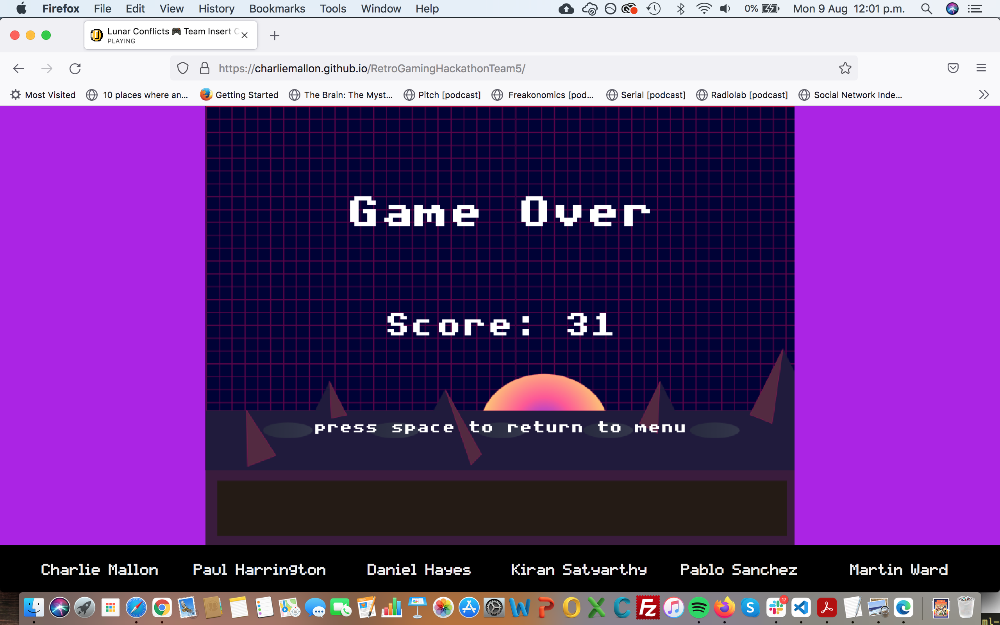           |        |       |         |       |       |       |         |       |   
|          |                 |      |                |        |       |         |       |       |       |         |       |   
|          |     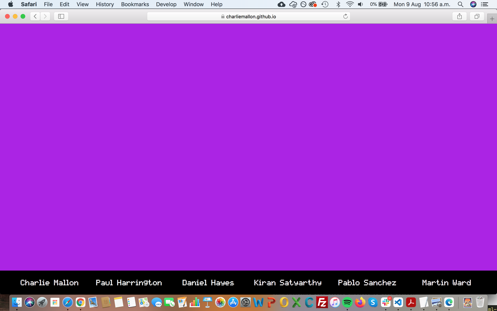            |      |                |        |       |         |       |       |       |         |       | 
|          |                 |      |                |        |       |         |       |       |       |         |       | 

  - A broad selection of physical devices were used to test real-life responsiveness. These ranged in size from a [Samsung Galaxy S5 (screen width 360px)](https://en.wikipedia.org/wiki/Samsung_Galaxy_S5) right up to a [JVC 32" LED Android Smart TV](https://www.currys.ie/ieen/tv-and-home-entertainment/televisions/televisions/jvc-lt-32ca690-android-tv-32-smart-hd-ready-led-tv-with-google-assistant-10199524-pdt.html) (using this device's native [Odin browser/ADK](https://play.google.com/store/apps/details?id=com.hisense.odinbrowser&hl=en&gl=US)). Other devices used in testing included the [Moto G4](https://en.wikipedia.org/wiki/Moto_G4) and [Huawei P20](https://en.wikipedia.org/wiki/Huawei_P20) smartphones, a [Kindle Fire HD](https://en.wikipedia.org/wiki/Fire_HD) tablet, an [Acer ΛSPIRE F15 Windows laptop](https://en.wikipedia.org/wiki/Acer_Aspire_laptops#Aspire_F_series) and a [13" MacBook Pro](https://en.wikipedia.org/wiki/MacBook_Pro#3rd_generation_(Retina)).

  - In addition to Chrome, Firefox and the emerging Odin smart TV browser, the site was also viewed numerous times in the Safari, Microsoft Edge and Amazon Silk browsers prior to completion.

### Bugs:

- #### Fixed Bugs:

  

  <b>click to view</b>
  

- #### Unfixed Bugs:

  

  <b>click to view</b>
  

