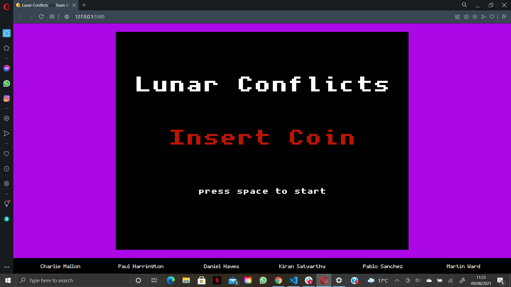
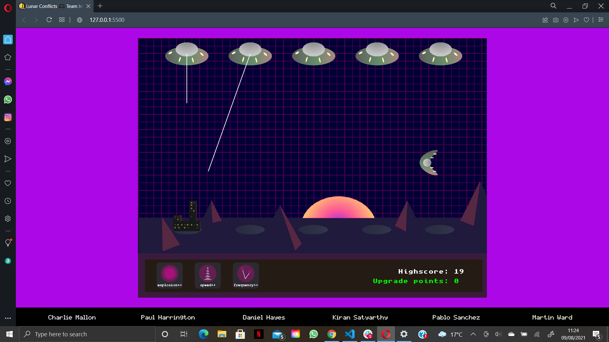
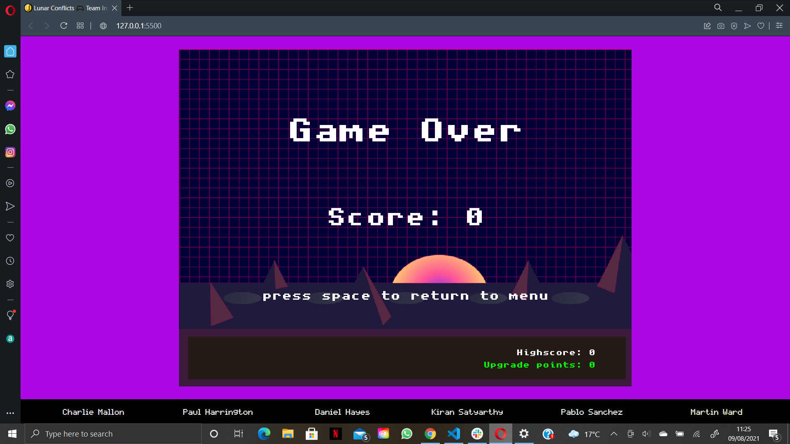

## Testing

### Validation:

  

  <b>click to view</b>
  

- [W3C](https://www.w3.org/)'s [Markup Validation Service](https://validator.w3.org/) was used to test the validity of all HTML used in this project. The code was [validated by direct input](https://validator.w3.org/#validate_by_input), and all suggested corrections were then made. As a result, all of the site's HTML source code now passes W3C validation with just a single warning message being returned, as is reflected in the following screenshot:
  - [index.html validation](#)

- Likewise, the website's custom CSS stylesheet was checked for errors using [W3C](https://www.w3.org/)'s [CSS Validation Service](https://jigsaw.w3.org/css-validator/). Once again, [validation by direct input](https://jigsaw.w3.org/css-validator/#validate_by_input) was the preferred method selected, and all necessary changes were subsequently carried out. Consequently, the stylesheet now returns a "Congratulations! No error found." message upon being passed through this validator, as the following screenshot indicates:
  - [static/css/style.css validation](#)

- In a similar manner, all of the site's custom JavaScript files were validated against [JSHint](https://jshint.com/)'s error-detection tool, which is available both as an online linter and a Gitpod/VS Code extension for real-time JS problem-solving. After heeding various warning and error messages, at the time of deployment each of these .js documents passed JSHint validation with no problems detected.

|   |   |   | 
| :------------: |:---------------: |:-----:|
         |                 | 

### Responsiveness:

  

  <b>click to view</b>
  

  - All testing was performed manually, and on a near-constant basis as the project evolved. [Google Chrome DevTools](https://developers.google.com/web/tools/chrome-devtools/?utm_source=dcc&utm_medium=redirect&utm_campaign=2018Q2) served as an indispensable resource throughout this testing process, allowing incremental adjustments to be made to the site's infrastructure and layout.

| Devices |  |  |  | 
| :------------ |:---------------: |:---------------:|:---------------:|
|    **MacBook Pro**      |                 |      |                
|    **Acer ΛSPIRE**      |                 |      |     
|    **Android Smart TV**      |                 |      |     

| Browsers |  |  |  |
| :------------ |:---------------: |:---------------:|:---------------:|
|          |                 |      |     
|         |                 |      |     
|          |                 |      |       
|          |                 |      |     
|          |                 |      |     
|          |                 |      |     

  - A broad selection of desktop devices were used to test real-life responsiveness. These ranged in size from a [13" MacBook Pro](https://en.wikipedia.org/wiki/MacBook_Pro#3rd_generation_(Retina)) right up to a [JVC 32" LED Android Smart TV](https://www.currys.ie/ieen/tv-and-home-entertainment/televisions/televisions/jvc-lt-32ca690-android-tv-32-smart-hd-ready-led-tv-with-google-assistant-10199524-pdt.html) (using this device's native [Odin browser/ADK](https://play.google.com/store/apps/details?id=com.hisense.odinbrowser&hl=en&gl=US)). Other devices used in testing included an [Acer ΛSPIRE F15 Windows laptop](https://en.wikipedia.org/wiki/Acer_Aspire_laptops#Aspire_F_series).

  - In addition to Chrome, Firefox and the emerging Odin smart TV browser, the site was also viewed numerous times in the Safari, Opera and Microsoft Edge browsers prior to completion.

### Bugs:

- #### Fixed Bugs:

  

  <b>click to view</b>
  

- #### Unfixed Bugs:

  

  <b>click to view</b>
  

